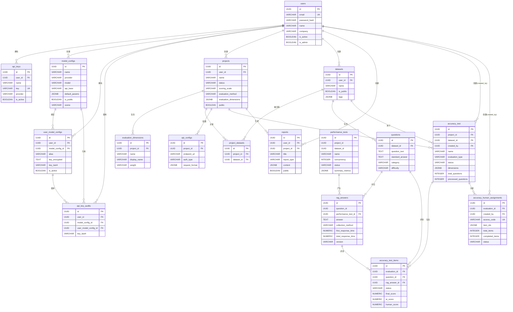
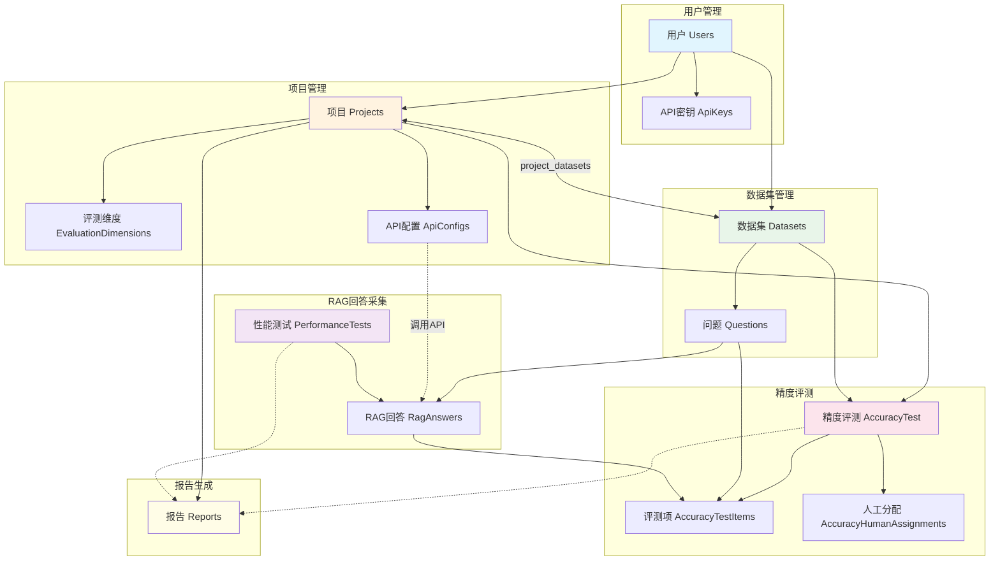
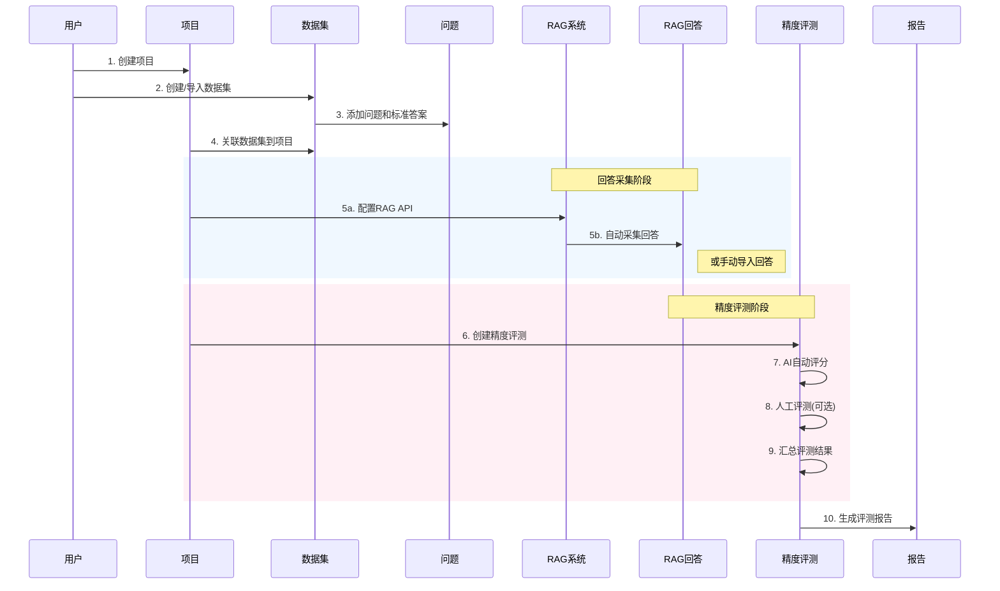

# RAG Evaluation 数据库设计文档

本文档描述 RAG 评测系统的数据库表结构设计。

---

## 🟢 1. 用户表 (`users`)

**业务含义**：存储系统用户的基本信息和账户状态。

| 字段名 | 类型 | 必填 | 默认值 | 业务含义与逻辑 |
| :----- | :--- | :--- | :----- | :------------- |
| `id` | UUID | YES | uuid4 | 主键，UUID 格式 |
| `email` | VARCHAR(255) | YES | - | 用户邮箱，唯一索引 |
| `password_hash` | VARCHAR(255) | YES | - | 密码哈希值 |
| `name` | VARCHAR(100) | NO | NULL | 用户姓名 |
| `company` | VARCHAR(100) | NO | NULL | 所属公司 |
| `bio` | TEXT | NO | NULL | 个人简介 |
| `avatar_url` | VARCHAR(255) | NO | NULL | 头像 URL |
| `is_active` | BOOLEAN | NO | TRUE | 账户是否激活 |
| `is_admin` | BOOLEAN | NO | FALSE | 是否为管理员 |
| `created_at` | TIMESTAMPTZ | NO | NOW() | 创建时间 |
| `updated_at` | TIMESTAMPTZ | NO | NOW() | 更新时间，自动更新 |

---

## 🟢 2. API 密钥表 (`api_keys`)

**业务含义**：存储用户配置的第三方 LLM 服务 API 密钥。

| 字段名 | 类型 | 必填 | 默认值 | 业务含义与逻辑 |
| :----- | :--- | :--- | :----- | :------------- |
| `id` | UUID | YES | uuid4 | 主键 |
| `user_id` | UUID | YES | - | 外键 → `users.id`，级联删除 |
| `name` | VARCHAR(100) | YES | - | 密钥名称，便于用户识别 |
| `key` | VARCHAR(100) | YES | - | API 密钥值，唯一索引 |
| `provider` | VARCHAR(50) | YES | - | 服务提供商：`openai`、`anthropic` 等 |
| `is_active` | BOOLEAN | NO | TRUE | 密钥是否启用 |
| `created_at` | TIMESTAMPTZ | NO | NOW() | 创建时间 |
| `updated_at` | TIMESTAMPTZ | NO | NOW() | 更新时间 |

---

## 🟢 2.1 模型配置表 (`model_configs`)

**业务含义**：存储可复用的模型配置元数据，用于多厂商路由与默认参数管理。

| 字段名 | 类型 | 必填 | 默认值 | 业务含义与逻辑 |
| :----- | :--- | :--- | :----- | :------------- |
| `id` | UUID | YES | uuid4 | 主键 |
| `name` | VARCHAR(100) | YES | - | 配置名称 |
| `provider` | VARCHAR(50) | YES | - | 厂商/协议类型 |
| `model` | VARCHAR(100) | YES | - | 模型名称 |
| `api_base` | VARCHAR(255) | NO | NULL | 自定义 API 地址 |
| `default_params` | JSONB | NO | NULL | 模型默认参数 |
| `is_public` | BOOLEAN | NO | FALSE | 是否公开 |
| `created_by` | UUID | NO | NULL | 创建者（外键 → users.id） |
| `scene` | VARCHAR(255) | NO | NULL | 用户自定义场景备注 |
| `created_at` | TIMESTAMPTZ | NO | NOW() | 创建时间 |
| `updated_at` | TIMESTAMPTZ | NO | NOW() | 更新时间 |

---

## 🟢 2.2 用户模型密钥绑定表 (`user_model_configs`)

**业务含义**：用户与模型配置的多对多绑定，保存加密后的 API Key 与状态信息。

| 字段名 | 类型 | 必填 | 默认值 | 业务含义与逻辑 |
| :----- | :--- | :--- | :----- | :------------- |
| `id` | UUID | YES | uuid4 | 主键 |
| `user_id` | UUID | YES | - | 外键 → users.id |
| `model_config_id` | UUID | YES | - | 外键 → model_configs.id |
| `alias` | VARCHAR(100) | NO | NULL | 用户别名 |
| `key_encrypted` | TEXT | YES | - | 加密后的密钥 |
| `key_last4` | VARCHAR(4) | YES | - | 密钥末 4 位 |
| `key_hash` | VARCHAR(64) | NO | NULL | 密钥哈希（去重/检测） |
| `is_active` | BOOLEAN | NO | TRUE | 是否启用 |
| `rotated_at` | TIMESTAMPTZ | NO | NULL | 轮换时间 |
| `revoked_at` | TIMESTAMPTZ | NO | NULL | 撤销时间 |
| `created_at` | TIMESTAMPTZ | NO | NOW() | 创建时间 |
| `updated_at` | TIMESTAMPTZ | NO | NOW() | 更新时间 |

---

## 🟢 2.3 API Key 使用审计表 (`api_key_audits`)

**业务含义**：记录 API Key 的使用审计信息。

| 字段名 | 类型 | 必填 | 默认值 | 业务含义与逻辑 |
| :----- | :--- | :--- | :----- | :------------- |
| `id` | UUID | YES | uuid4 | 主键 |
| `user_id` | UUID | YES | - | 外键 → users.id |
| `model_config_id` | UUID | NO | NULL | 外键 → model_configs.id |
| `user_model_config_id` | UUID | NO | NULL | 外键 → user_model_configs.id |
| `key_last4` | VARCHAR(4) | NO | NULL | 密钥末 4 位 |
| `created_at` | TIMESTAMPTZ | NO | NOW() | 使用时间 |

---

## 🟢 3. 项目表 (`projects`)

**业务含义**：RAG 评测项目，是评测任务的顶层组织单元。

| 字段名 | 类型 | 必填 | 默认值 | 业务含义与逻辑 |
| :----- | :--- | :--- | :----- | :------------- |
| `id` | UUID | YES | uuid4 | 主键 |
| `user_id` | UUID | YES | - | 外键 → `users.id`，级联删除 |
| `name` | VARCHAR(100) | YES | - | 项目名称 |
| `description` | TEXT | NO | NULL | 项目描述 |
| `status` | VARCHAR(20) | YES | 'created' | 项目状态 |
| `scoring_scale` | VARCHAR(20) | YES | '1-5' | 评分量表，如 `1-5`、`1-10` |
| `evaluation_method` | VARCHAR(20) | YES | 'auto' | 评测方式：`auto`（自动）、`manual`（人工）、`hybrid`（混合） |
| `settings` | JSONB | NO | {} | 项目配置信息 |
| `public` | BOOLEAN | NO | FALSE | 是否公开 |
| `evaluation_dimensions` | JSONB | NO | [默认维度] | 评测维度配置，包含 `accuracy`、`relevance`、`completeness`、`conciseness` |
| `created_at` | TIMESTAMPTZ | NO | NOW() | 创建时间 |
| `updated_at` | TIMESTAMPTZ | NO | NOW() | 更新时间 |

**评测维度默认值**：
```json
[
  {"name": "accuracy", "weight": 1.0, "description": "评估回答的事实准确性", "enabled": true},
  {"name": "relevance", "weight": 1.0, "description": "评估回答与问题的相关程度", "enabled": true},
  {"name": "completeness", "weight": 1.0, "description": "评估回答信息的完整性", "enabled": true},
  {"name": "conciseness", "weight": 1.0, "description": "评估回答是否简洁无冗余", "enabled": false}
]
```

---

## 🟢 4. 评测维度表 (`evaluation_dimensions`)

**业务含义**：项目的自定义评测维度配置（独立表形式）。

| 字段名 | 类型 | 必填 | 默认值 | 业务含义与逻辑 |
| :----- | :--- | :--- | :----- | :------------- |
| `id` | UUID | YES | uuid4 | 主键 |
| `project_id` | UUID | YES | - | 外键 → `projects.id`，级联删除 |
| `name` | VARCHAR(50) | YES | - | 维度标识名，如 `accuracy` |
| `display_name` | VARCHAR(100) | YES | - | 维度显示名称 |
| `description` | TEXT | NO | NULL | 维度描述 |
| `weight` | VARCHAR(10) | NO | '1.0' | 权重值 |
| `created_at` | TIMESTAMPTZ | NO | NOW() | 创建时间 |

---

## 🟢 5. 数据集表 (`datasets`)

**业务含义**：存储评测问答数据集的元信息。

| 字段名 | 类型 | 必填 | 默认值 | 业务含义与逻辑 |
| :----- | :--- | :--- | :----- | :------------- |
| `id` | UUID | YES | uuid4 | 主键 |
| `user_id` | UUID | YES | - | 外键 → `users.id`，级联删除 |
| `name` | VARCHAR(100) | YES | - | 数据集名称 |
| `description` | TEXT | NO | NULL | 数据集描述 |
| `is_public` | BOOLEAN | NO | FALSE | 是否公开共享 |
| `tags` | JSONB | NO | [] | 标签列表 |
| `dataset_metadata` | JSONB | NO | {} | 数据集元数据 |
| `created_at` | TIMESTAMPTZ | NO | NOW() | 创建时间 |
| `updated_at` | TIMESTAMPTZ | NO | NOW() | 更新时间 |

---

## 🟢 6. 项目-数据集关联表 (`project_datasets`)

**业务含义**：项目与数据集的多对多关联关系。

| 字段名 | 类型 | 必填 | 默认值 | 业务含义与逻辑 |
| :----- | :--- | :--- | :----- | :------------- |
| `id` | UUID | YES | uuid4 | 主键 |
| `project_id` | UUID | YES | - | 外键 → `projects.id`，级联删除 |
| `dataset_id` | UUID | YES | - | 外键 → `datasets.id`，限制删除 |
| `created_at` | TIMESTAMPTZ | NO | NOW() | 关联创建时间 |

**约束**：`(project_id, dataset_id)` 联合唯一约束

---

## 🟢 7. 问题表 (`questions`)

**业务含义**：数据集中的评测问题及标准答案。

| 字段名 | 类型 | 必填 | 默认值 | 业务含义与逻辑 |
| :----- | :--- | :--- | :----- | :------------- |
| `id` | UUID | YES | uuid4 | 主键 |
| `dataset_id` | UUID | YES | - | 外键 → `datasets.id`，级联删除 |
| `question_text` | TEXT | YES | - | 问题文本 |
| `standard_answer` | TEXT | YES | - | 标准答案 |
| `category` | VARCHAR(50) | NO | NULL | 问题分类：`事实型`、`推理型` 等 |
| `difficulty` | VARCHAR(20) | NO | NULL | 难度级别：`简单`、`中等`、`困难` |
| `type` | VARCHAR(50) | NO | NULL | 问题类型 |
| `tags` | JSONB | NO | NULL | 问题标签 |
| `question_metadata` | JSONB | NO | NULL | 问题元数据 |
| `created_at` | TIMESTAMPTZ | NO | NOW() | 创建时间 |
| `updated_at` | TIMESTAMPTZ | NO | NOW() | 更新时间 |

---

## 🟢 8. RAG 回答表 (`rag_answers`)

**业务含义**：存储 RAG 系统对问题的回答及性能指标。

| 字段名 | 类型 | 必填 | 默认值 | 业务含义与逻辑 |
| :----- | :--- | :--- | :----- | :------------- |
| `id` | UUID | YES | uuid4 | 主键 |
| `question_id` | UUID | YES | - | 关联问题 ID（无外键约束） |
| `answer` | TEXT | YES | - | RAG 系统生成的回答 |
| `collection_method` | VARCHAR(20) | YES | 'api' | 采集方式：`api`（接口调用）、`manual_import`（手动导入） |
| `sequence_number` | INTEGER | NO | NULL | 性能测试中的序号 |
| `first_response_time` | NUMERIC(10,3) | NO | NULL | 首次响应时间（秒） |
| `total_response_time` | NUMERIC(10,3) | NO | NULL | 总响应时间（秒） |
| `character_count` | INTEGER | NO | NULL | 回答字符数 |
| `characters_per_second` | NUMERIC(10,2) | NO | NULL | 每秒生成字符数 |
| `raw_response` | JSONB | NO | NULL | 原始响应数据 |
| `version` | VARCHAR(50) | NO | NULL | 版本标识 |
| `created_at` | TIMESTAMPTZ | NO | NOW() | 创建时间 |
| `performance_test_id` | UUID | NO | NULL | 外键 → `performance_tests.id`，SET NULL |

**约束**：`(question_id, version)` 联合唯一约束

---

## 🟢 9. API 配置表 (`api_configs`)

**业务含义**：RAG 系统 API 接口配置，用于自动采集回答。

| 字段名 | 类型 | 必填 | 默认值 | 业务含义与逻辑 |
| :----- | :--- | :--- | :----- | :------------- |
| `id` | UUID | YES | uuid4 | 主键 |
| `project_id` | UUID | YES | - | 外键 → `projects.id`，级联删除 |
| `endpoint_url` | VARCHAR(255) | YES | - | API 端点 URL |
| `auth_type` | VARCHAR(20) | YES | 'none' | 认证类型：`none`、`api_key`、`basic_auth` |
| `api_key` | VARCHAR(255) | NO | NULL | API 密钥（api_key 认证时使用） |
| `username` | VARCHAR(100) | NO | NULL | 用户名（basic_auth 认证时使用） |
| `password` | VARCHAR(255) | NO | NULL | 密码（basic_auth 认证时使用） |
| `request_format` | JSONB | NO | NULL | 请求格式模板 |
| `response_path` | VARCHAR(255) | NO | NULL | 响应中提取答案的 JSON 路径 |
| `created_at` | TIMESTAMPTZ | NO | NOW() | 创建时间 |
| `updated_at` | TIMESTAMPTZ | NO | NOW() | 更新时间 |

---

## 🟢 10. 精度评测表 (`accuracy_test`)

**业务含义**：精度评测任务的主表，记录评测配置和整体进度。

| 字段名 | 类型 | 必填 | 默认值 | 业务含义与逻辑 |
| :----- | :--- | :--- | :----- | :------------- |
| `id` | UUID | YES | uuid4 | 主键 |
| `project_id` | UUID | YES | - | 外键 → `projects.id`，级联删除 |
| `dataset_id` | UUID | YES | - | 外键 → `datasets.id`，级联删除 |
| `name` | VARCHAR(255) | YES | - | 评测名称 |
| `description` | TEXT | NO | NULL | 评测描述 |
| `evaluation_type` | VARCHAR(20) | YES | - | 评测类型：`auto`、`manual`、`hybrid` |
| `scoring_method` | VARCHAR(20) | YES | - | 评分方法 |
| `status` | VARCHAR(20) | YES | 'created' | 状态：`created`、`running`、`completed`、`failed` |
| `dimensions` | JSONB | YES | ["accuracy"] | 评测维度列表 |
| `weights` | JSONB | NO | {"accuracy": 1.0} | 维度权重配置 |
| `model_config_test` | JSONB | NO | NULL | 模型配置 |
| `prompt_template` | TEXT | NO | NULL | 提示词模板 |
| `version` | VARCHAR(50) | NO | NULL | 版本标识 |
| `total_questions` | INTEGER | NO | 0 | 总问题数 |
| `processed_questions` | INTEGER | NO | 0 | 已处理问题数 |
| `success_questions` | INTEGER | NO | 0 | 成功问题数 |
| `failed_questions` | INTEGER | NO | 0 | 失败问题数 |
| `batch_settings` | JSONB | NO | {"batch_size": 10, "timeout_seconds": 300} | 批处理配置 |
| `results_summary` | JSONB | NO | NULL | 评测结果汇总 |
| `prompt` | TEXT | NO | NULL | 评测提示词 |
| `created_at` | TIMESTAMPTZ | NO | NOW() | 创建时间 |
| `started_at` | TIMESTAMPTZ | NO | NULL | 开始时间 |
| `completed_at` | TIMESTAMPTZ | NO | NULL | 完成时间 |
| `created_by` | UUID | NO | NULL | 外键 → `users.id`，SET NULL |

---

## 🟢 11. 精度评测项表 (`accuracy_test_items`)

**业务含义**：精度评测中每个问题的评测详情和评分结果。

| 字段名 | 类型 | 必填 | 默认值 | 业务含义与逻辑 |
| :----- | :--- | :--- | :----- | :------------- |
| `id` | UUID | YES | uuid4 | 主键 |
| `evaluation_id` | UUID | YES | - | 外键 → `accuracy_test.id`，级联删除 |
| `question_id` | UUID | YES | - | 外键 → `questions.id` |
| `rag_answer_id` | UUID | YES | - | 外键 → `rag_answers.id` |
| `status` | VARCHAR(20) | NO | 'pending' | 状态：`pending`、`completed`、`failed` |
| `final_score` | NUMERIC | NO | NULL | 最终评分 |
| `final_dimension_scores` | JSONB | NO | NULL | 各维度最终评分 |
| `final_evaluation_reason` | TEXT | NO | NULL | 最终评价理由 |
| `final_evaluation_type` | VARCHAR(20) | NO | NULL | 最终评价类型：`ai`、`human` |
| `ai_score` | NUMERIC | NO | NULL | AI 评分 |
| `ai_dimension_scores` | JSONB | NO | NULL | AI 各维度评分 |
| `ai_evaluation_reason` | TEXT | NO | NULL | AI 评价理由 |
| `ai_evaluation_time` | TIMESTAMPTZ | NO | NULL | AI 评测时间 |
| `ai_raw_response` | JSONB | NO | NULL | AI 原始响应 |
| `human_score` | NUMERIC | NO | NULL | 人工评分 |
| `human_dimension_scores` | JSONB | NO | NULL | 人工各维度评分 |
| `human_evaluation_reason` | TEXT | NO | NULL | 人工评价理由 |
| `human_evaluator_id` | VARCHAR(100) | NO | NULL | 人工评测员 ID |
| `human_evaluation_time` | TIMESTAMPTZ | NO | NULL | 人工评测时间 |
| `sequence_number` | INTEGER | NO | NULL | 序号 |
| `item_metadata` | JSONB | NO | NULL | 元数据 |

**约束**：`(evaluation_id, question_id)` 联合唯一约束

---

## 🟢 12. 人工评测分配表 (`accuracy_human_assignments`)

**业务含义**：人工评测任务的分配记录，支持外部评测员通过访问码参与评测。

| 字段名 | 类型 | 必填 | 默认值 | 业务含义与逻辑 |
| :----- | :--- | :--- | :----- | :------------- |
| `id` | UUID | YES | uuid4 | 主键 |
| `evaluation_id` | UUID | YES | - | 外键 → `accuracy_test.id`，级联删除 |
| `access_code` | VARCHAR(20) | YES | - | 访问码，唯一索引，用于外部评测员登录 |
| `evaluator_name` | VARCHAR(100) | NO | NULL | 评测员姓名 |
| `evaluator_email` | VARCHAR(255) | NO | NULL | 评测员邮箱 |
| `item_ids` | JSONB | YES | - | 分配的评测项 ID 列表 |
| `total_items` | INTEGER | YES | - | 分配总数 |
| `completed_items` | INTEGER | NO | 0 | 已完成数 |
| `status` | VARCHAR(20) | NO | 'assigned' | 状态：`assigned`、`in_progress`、`completed` |
| `is_active` | BOOLEAN | NO | TRUE | 是否有效 |
| `expiration_date` | TIMESTAMPTZ | NO | NULL | 过期时间 |
| `assigned_at` | TIMESTAMPTZ | NO | NOW() | 分配时间 |
| `last_activity_at` | TIMESTAMPTZ | NO | NULL | 最后活动时间 |
| `completed_at` | TIMESTAMPTZ | NO | NULL | 完成时间 |
| `created_by` | UUID | NO | NULL | 外键 → `users.id`，SET NULL |

---

## 🟢 13. 性能测试表 (`performance_tests`)

**业务含义**：RAG 系统性能测试任务，记录并发测试配置和结果汇总。

| 字段名 | 类型 | 必填 | 默认值 | 业务含义与逻辑 |
| :----- | :--- | :--- | :----- | :------------- |
| `id` | UUID | YES | uuid4 | 主键 |
| `name` | VARCHAR(100) | YES | - | 测试名称 |
| `project_id` | UUID | YES | - | 关联项目 ID（无外键约束） |
| `dataset_id` | UUID | NO | NULL | 关联数据集 ID（无外键约束） |
| `description` | TEXT | NO | NULL | 测试描述 |
| `concurrency` | INTEGER | YES | - | 并发数 |
| `version` | VARCHAR(50) | NO | NULL | 版本标识 |
| `created_at` | TIMESTAMPTZ | NO | NOW() | 创建时间 |
| `started_at` | TIMESTAMPTZ | NO | NULL | 开始时间 |
| `completed_at` | TIMESTAMPTZ | NO | NULL | 完成时间 |
| `status` | VARCHAR(20) | YES | 'created' | 状态：`created`、`running`、`completed`、`failed`、`terminated` |
| `config` | JSONB | YES | {} | 测试配置 |
| `total_questions` | INTEGER | YES | 0 | 总问题数 |
| `processed_questions` | INTEGER | YES | 0 | 已处理问题数 |
| `success_questions` | INTEGER | YES | 0 | 成功问题数 |
| `failed_questions` | INTEGER | YES | 0 | 失败问题数 |
| `summary_metrics` | JSONB | YES | {} | 性能指标汇总（平均响应时间、吞吐量等） |
| `rag_config` | VARCHAR(200) | NO | NULL | RAG 配置标识 |

---

## 🟢 14. 报告表 (`reports`)

**业务含义**：评测报告，支持多种报告类型的生成和存储。

| 字段名 | 类型 | 必填 | 默认值 | 业务含义与逻辑 |
| :----- | :--- | :--- | :----- | :------------- |
| `id` | UUID | YES | uuid4 | 主键 |
| `user_id` | UUID | YES | - | 外键 → `users.id`，级联删除 |
| `project_id` | UUID | YES | - | 外键 → `projects.id`，级联删除 |
| `title` | VARCHAR(200) | YES | - | 报告标题 |
| `description` | TEXT | NO | NULL | 报告描述 |
| `report_type` | VARCHAR(50) | YES | - | 报告类型：`evaluation`（评测）、`performance`（性能）、`comparison`（对比） |
| `public` | BOOLEAN | NO | FALSE | 是否公开 |
| `config` | JSONB | NO | NULL | 报告配置 |
| `content` | JSONB | NO | NULL | 报告内容 |
| `created_at` | TIMESTAMPTZ | NO | NOW() | 创建时间 |
| `updated_at` | TIMESTAMPTZ | NO | NOW() | 更新时间 |

---

## 📊 实体关系图 (ER Diagram)



---

## 🔄 业务流程图



---

## 📋 核心业务流程说明



---

## 🔑 主要外键关系

| 子表 | 外键字段 | 父表 | 删除行为 |
| :--- | :------- | :--- | :------- |
| `api_keys` | `user_id` | `users` | CASCADE |
| `model_configs` | `created_by` | `users` | SET NULL |
| `user_model_configs` | `user_id` | `users` | CASCADE |
| `user_model_configs` | `model_config_id` | `model_configs` | CASCADE |
| `api_key_audits` | `user_id` | `users` | CASCADE |
| `api_key_audits` | `model_config_id` | `model_configs` | SET NULL |
| `api_key_audits` | `user_model_config_id` | `user_model_configs` | SET NULL |
| `projects` | `user_id` | `users` | CASCADE |
| `datasets` | `user_id` | `users` | CASCADE |
| `evaluation_dimensions` | `project_id` | `projects` | CASCADE |
| `project_datasets` | `project_id` | `projects` | CASCADE |
| `project_datasets` | `dataset_id` | `datasets` | RESTRICT |
| `questions` | `dataset_id` | `datasets` | CASCADE |
| `api_configs` | `project_id` | `projects` | CASCADE |
| `rag_answers` | `performance_test_id` | `performance_tests` | SET NULL |
| `accuracy_test` | `project_id` | `projects` | CASCADE |
| `accuracy_test` | `dataset_id` | `datasets` | CASCADE |
| `accuracy_test` | `created_by` | `users` | SET NULL |
| `accuracy_test_items` | `evaluation_id` | `accuracy_test` | CASCADE |
| `accuracy_test_items` | `question_id` | `questions` | - |
| `accuracy_test_items` | `rag_answer_id` | `rag_answers` | - |
| `accuracy_human_assignments` | `evaluation_id` | `accuracy_test` | CASCADE |
| `accuracy_human_assignments` | `created_by` | `users` | SET NULL |
| `reports` | `user_id` | `users` | CASCADE |
| `reports` | `project_id` | `projects` | CASCADE |

---

## 📝 备注

1. 所有主键均使用 UUID 类型，通过 `StringUUID` 自定义类型实现跨数据库兼容
2. 时间字段统一使用带时区的 `TIMESTAMPTZ` 类型
3. `rag_answers.question_id` 和 `performance_tests.project_id/dataset_id` 在模型层未定义外键约束，需在应用层保证数据一致性
4. JSONB 类型字段用于存储灵活的配置和元数据信息
